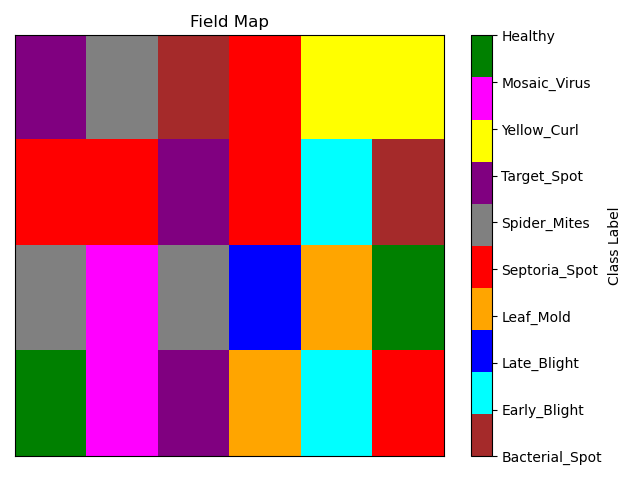

# LeafGuard-AI
CNN-Based Plant Disease Classification Web Application

No code provided. A **technical demo** showing the full application in execution is available upon request.

---

## Problem Domain

Plant diseases are a major threat to global food production. Early identification is essential for preventing crop loss, especially in resource-constrained agricultural settings. Manual inspection is time-consuming, error-prone, and often infeasible at scale. This precision agriculture application offers an accessible, intelligent diagnostic tool to support decision-making in the field.

---

## Solution Overview

This precision agriculture web application uses a convolutional neural network (CNN) trained on leaf images to identify and classify plant diseases, producing real-time predictions for actionable insights. 

**Key Highlights:**
- **~99.5% accuracy** for binary classification (healthy vs. diseased)
- **~94.5% accuracy** across 10 distinct disease classes
- **Interactive GUI** supports model switching, evaluation, data analysis, and batch image classification
- **Field Mapping:** Color-coded disease location mapping for field deployment and spatial insight
- **Rapid Batch Processing:** Classifies a 24-image batch, with confidence scores and visualizations, in under 3 seconds
- **Scalable:** Architecture is designed for high-throughput inference, capable of processing batches of images from multiple field sites simultaneously

---

## Key Features & Screenshots

### Prototype GUI

Interactive widget-based interface used in the Jupyter Notebook prototype. Features shown here were later implemented in the deployed web application.

  

---

### Web Application GUI

Functional interface for the deployed FastAPI web application. Executes classification, generates visualizations, and serves PNG outputs directly to the user.

 

---

### Run Batch Predictions

Processes a 24-image batch in under 3 seconds. Returns predicted classes along with confidence scores and visualization. Enables rapid, scalable disease detection for field applications.

 

---

### Generate Field Map

Creates a color-coded field map based on batch image predictions, visually representing the spatial distribution of detected plant diseases for quick assessment and actionable field insights.

 

---

### Display Class Images

Displays sample images with known class labels. Useful for visual comparison, pattern recognition, and model behavior analysis.

---

### Generate Class Distribution

Displays the class distribution of the test set, ensuring that model performance is evaluated against a representative and balanced sample of disease categories.

 

---

### Generate Confusion Matrix

Model performance against the full 1000 image test set. The dark diagonal line represents correct classifications. Anything outside this line is an incorrect classification. Allows for granular interpretation of model accuracy and class-specific performance.

 

---

## Data & Model Architecture

- Custom Convolutional Neural Network (CNN) with regularization, no pretained models
- Multiple models were trained; the strongest performer selected for deployment
- Trained, validated, and tested on the **Tomato Leaf Disease Detection** dataset, containing 11,000 images
- Clean splits maintained for testing, validation, and training; no data leakage
- Data Augmentation techniques include RandomRotation, RandomFlip, and RandomCutout.  

---

## Key Development Milestones

Originally built as a Jupyter notebook prototype with interactive GUI widgets before being refactored into a deployed web application using FastAPI.

**Key Development Milestones:**
- **Data Acquisition**: Collected and verified plant disease image dataset, **Tomato Leaf Disease Detection**
- **Data Cleaning**: Processed and renamed corrupted files; standardized formats and labels
- **Data Augmentation**: Implemented augmentation techniques to increase data diversity and model robustness
- **Model Development**: Designed and trained multiple Convolutional Neural Network (CNN) architectures for disease classification
- **Evaluation & Tuning**: Conducted model testing to determine final model, optimized for both binary and multiclass accuracy
- **Model Performance Benchmarking**: Achieved ~99.5% binary and ~94.5% multiclass accuracy across test data
- **Batch Inference Engine**: Integrated batch processing and prediction confidence visualization
- **Disease Mapping**: Integrated color-coded field disease maps for actionable insights
- **Prototype Interface**: Built an interactive GUI in Jupyter using `ipywidgets` to enable easy function navigation
- **Deployment Refactor**: Ported prototype features into a FastAPI-based web app served with Uvicorn
- **Throughput Benchmarking**: Determined throughput for batch inference, under 3 seconds for 24-image batch

---

## Limitations & Future Work

### Generalization

- **Current Scope**: The model identifies diseases in tomato leaves only.
- **Expansion Path**: The workflow is fully generalizable to other crops and disease classes. Minimal architectural changes are needed thanks to the modular model-switching system.

### Field Deployment

- **Controlled Dataset**: High accuracy (~94.5% multiclass, ~99.5% binary) was achieved on test sets derived from lab-generated images.
- **Field Readiness**: To ensure robust performance in real-world conditions, retraining is recommended on field images that reflect actual deployment environments (e.g., lighting, backgrounds, camera distance).
- **Dual-Model Architecture** *(Planned)*: A proposed two-stage pipeline includes:
  - Stage 1: **Object Detection / Segmentation** to isolate leaves and reduce background noise
  - Stage 2: **Classification** on the cleaned image

### Human-in-the-Loop (HITL)

- **Planned Features**:
  - Image annotation interface for manual corrections
  - Confidence thresholding to flag uncertain predictions for human review
  - Iterative re-training from corrected examples to improve accuracy over time

### Data Management & Security

- **Searchable Database**: Store batch results indexed by model version, facility/site, date, and class
- **User Authentication**:
  - Login system for individual users, facilities, and field technicians
  - Role-based access control for annotation, viewing, or model switching
  - Password protection and session auditing
- **Audit Trail**: Track user annotations, prediction outcomes, and corrections for regulatory or operational transparency

### Interface Expansion

- **Sidebar Enhancements**:
  - Right panel for: database search, annotation tools, and model switching

**All future improvements listed here are within my current skill set. I demonstrate these capabilities in other portfolio projects, such as the GlassBox XAI system (advanced model optimization, segmentation, interpretability, and human-in-the-loop features), and the Customer Scheduling Management System (full-stack development with authentication, user auditing, database integration, and an expanded interface).**

---

## Tech Stack & Dependencies

**Core Frameworks & Libraries**  
- **Python** – Core programming language  
- **TensorFlow / Keras** – CNN model development and training  
- **Scikit-learn** – Evaluation metrics and utility functions  
- **NumPy** – Array operations and preprocessing  
- **Matplotlib** - Data visualization
- **Seaborn** – Confusion Matrices    
- **OpenCV** – Image handling, filtering, and transformations  

**Development & Prototyping**  
- **Jupyter Notebook** – Prototyping and experimentation  
- **ipywidgets** – Interactive UI components for the notebook GUI
- **VS Code** - Refactoring prototype to produce deployed web application.

**Web Application / API**  
- **FastAPI** – Lightweight web framework for serving models  
- **Uvicorn** – ASGI server used to run FastAPI apps  
- **Pydantic** – Data validation and request schema enforcement  

**Environment & Tooling**  
- **Anaconda** – Environment and package management  
- **Markdown** – Documentation and README formatting  

---

## Credits & References

- Alquethami, S., Almtanni, B., Alzhrani, W., & Alghamdi, M. (2022). Disease Detection in Apple Leaves Using Image Processing Techniques. *Engineering, Technology & Applied Science Research*, 12(2), 8335-8341.  
  [Link](https://etasr.com/index.php/ETASR/article/view/4721)

- Arsenovic, M., Karanovic, M., Sladojevic, S., Anderla, A., & Stefanovic, D. (2019). Solving Current Limitations of Deep Learning Based Approaches for Plant Disease Detection. *Symmetry*, 11(7), 939.  
  [DOI](http://dx.doi.org/10.3390/sym11070939)

- Kaustubh, B. (2020). *Tomato Leaf Disease Detection* (Version 1.0) [Dataset].  
  [Kaggle](https://www.kaggle.com/datasets/kaustubhb999/tomatoleaf)

- Kingma, D. P., & Ba, J. (2017). Adam: A Method for Stochastic Optimization. *arXiv preprint*.  
  [arXiv](https://doi.org/10.48550/arXiv.1412.6980)

- Jones, J. B., Zitter, T. A., Momol, T., & Miller, S. A. (2016). *Compendium of Tomato Diseases and Pests* (2nd ed.). Amer Phytopathological Society.

- Mohanty, S. P., Hughes, D. P., & Salathe, M. (2016). Using Deep Learning for Image-Based Plant Disease Detection. *Frontiers in Plant Science*, 7.  
  [Link](https://www.frontiersin.org/articles/10.3389/fpls.2016.01419)

---

## Author

**Jeffrey Robert Lynch** [LinkedIn](https://www.linkedin.com/in/jeffrey-lynch-350930348/)

---

## License

This project is for educational and demonstration purposes only. For commercial use, please contact the author.
